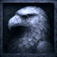
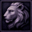

# Last Ditch
The Garden of Civilization

   

## Rendering

Last Ditch uses SDL3 for its window, input, timing, and SDL_GPU rendering. The
runtime consumes the checked-in shader artifacts under `assets/shaders/compiled`,
so a normal build does not require shader tools.

Regenerate shaders with `cmake --build build --target shaders`. A working `dxc`
produces SPIR-V and DXIL; `spirv-cross` produces MSL. When `dxc` is unavailable,
the script can use `glslangValidator` for SPIR-V/MSL while retaining existing
DXIL artifacts.
